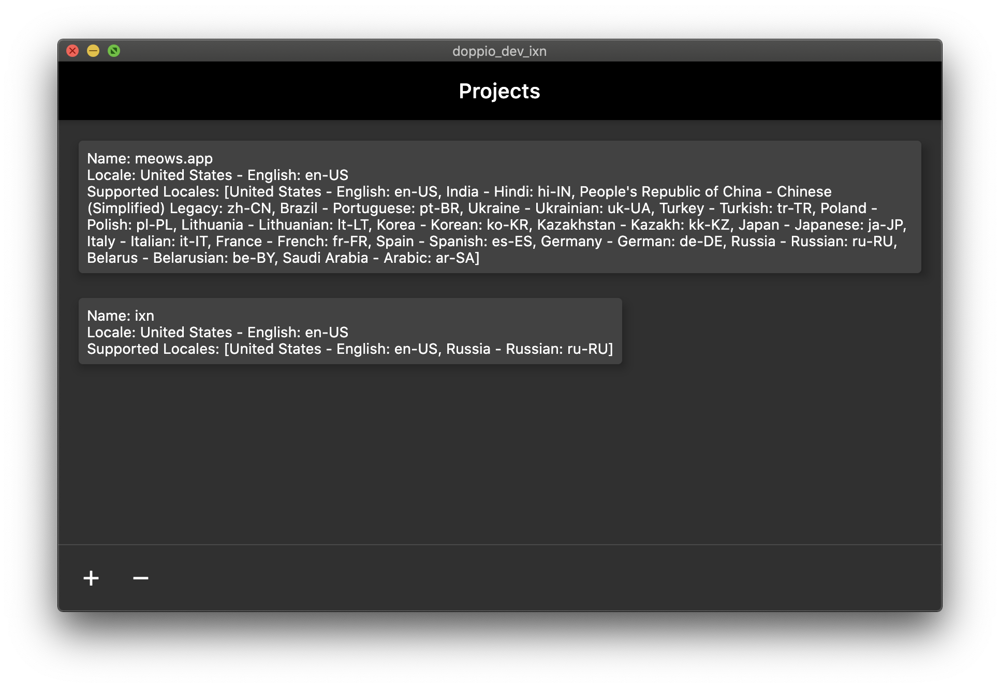
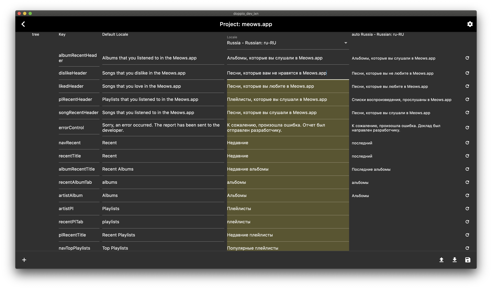
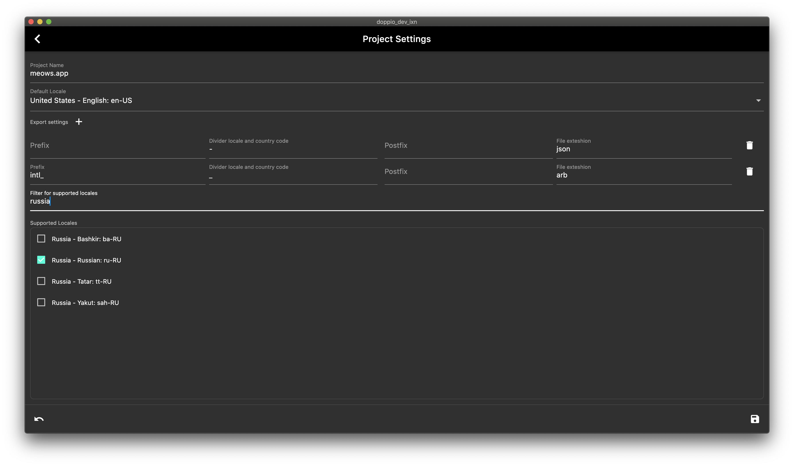

# iXn

Control your localization of apps with iXn!

please support me:

- star my repo and use app
- install [meows.app](https://meows.app) - player for Apple Music (use flutter)
- install extension for BLoC - [[FF] Flutter Files](https://marketplace.visualstudio.com/items?itemName=gornivv.vscode-flutter-files)
- use flutter - flutter the best!

## it-challenge

Create it product every day! - https://medium.com/it-challenge

## Is it ideal code?

No, this a product for users who want control localization of apps.

## Features

[+] MVP:

    - google translate
    - import json and arb
    - control change after change default locale
    - export to json.arb, custom format(json)
    - UI for edit words
    - web and mac version
    - check update version

[ ] compare origin and import

[ ] pictures

[ ] tree of structure

[ ] order control

[ ] validation for project

[ ] max length

[ ] notes

[ ] approve words

[ ] windows and linux version

[ ] app settings(locale & theme)

[ ] use DI (kiwi)

Screens:

